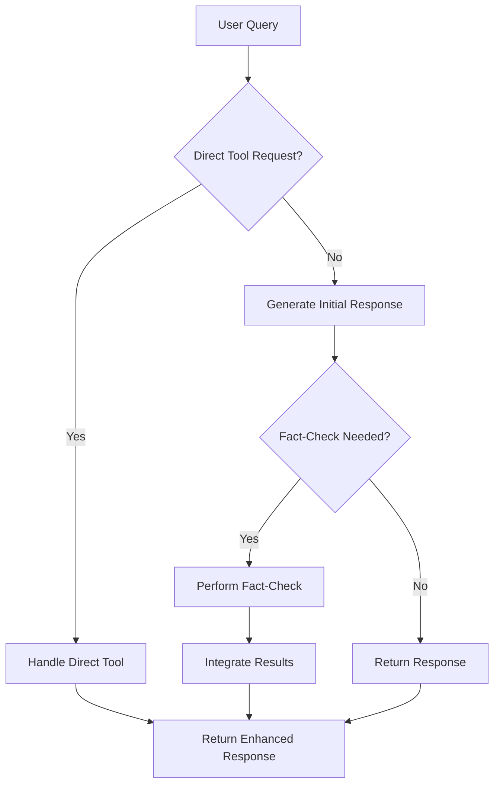

# Conditional Fact-Checking System Guide

## Overview

The Conditional Fact-Checking System integrates [llmfilters](https://github.com/piratos/llmfilters) to provide intelligent, on-demand fact-checking that only triggers when facts are challenged or the LLM expresses uncertainty. This system makes DanzarAI aware of its available tools (RAG, web search) and ensures factual accuracy without unnecessary overhead.

## Architecture

### Core Components

1. **ConditionalFactChecker** (`services/conditional_fact_checker.py`)
   - Uses llmfilters for intelligent challenge detection
   - Fallback pattern matching when llmfilters unavailable
   - Generates targeted search queries for fact verification

2. **EnhancedLLMService** (`services/enhanced_llm_service.py`)
   - Tool-aware LLM responses
   - Integration with conditional fact-checking
   - Direct tool request handling

3. **LLM Filters Integration**
   - ChallengeDetectionFilter: Detects user challenges and LLM uncertainty
   - FactCheckTriggerFilter: Triggers fact-checking based on detection results

## How It Works

### 1. Challenge Detection

The system detects fact-checking triggers through multiple methods:

#### LLM Filters (Primary)
```python
# Challenge patterns detected
r'\b(that\'?s\s+not\s+right|that\'?s\s+wrong|you\'?re\s+wrong)\b'
r'\b(are\s+you\s+sure|is\s+that\s+correct)\b'
r'\b(can\s+you\s+verify|can\s+you\s+check)\b'
r'\b(actually|in\s+fact|well\s+actually)\b'

# Uncertainty patterns detected
r'\b(I\s+think|I\s+believe|I\'?m\s+not\s+sure)\b'
r'\b(as\s+far\s+as\s+I\s+know|to\s+my\s+knowledge)\b'
```

#### Fallback Pattern Matching
When llmfilters is unavailable, the system uses regex pattern matching as a fallback.

### 2. Fact-Checking Process



### 3. Tool Awareness

The LLM is made aware of available tools through enhanced system prompts:

```
**Available Tools and Knowledge Sources:**

1. **Knowledge Base (RAG)**: EverQuest game information, guides, strategies
2. **Internet Search**: Current information, real-time data, fact verification
3. **Fact-Checking**: Verify claims when challenged or uncertain

**How to Use These Tools:**
- For EverQuest questions: Use knowledge base first, then web search
- For current events/news: Use web search directly
- When challenged: Acknowledge and offer to fact-check
- When uncertain: Express uncertainty and offer to verify
```

## Usage Examples

### Example 1: Direct Challenge
```
User: "That's not right about MacroQuest, you're wrong"
System: Detects challenge → Triggers fact-check → Searches for "MacroQuest fact check"
Response: "You're right to question that. Let me fact-check this information..."
```

### Example 2: Uncertainty Expression
```
User: "I'm not sure about that"
System: Detects uncertainty → Triggers fact-check → Searches for verification
Response: "I understand your uncertainty. Let me verify that information for you..."
```

### Example 3: Direct Tool Request
```
User: "Can you search the web for MacroQuest 2?"
System: Detects direct request → Performs web search directly
Response: "🔍 Web Search Results for 'MacroQuest 2'..."
```

### Example 4: Normal Conversation
```
User: "What's the weather like?"
System: No challenge/uncertainty detected → Normal response
Response: "I don't have access to real-time weather data, but I can help you find weather information..."
```

## Configuration

### Installation

1. **Install llmfilters**:
   ```bash
   pip install git+https://github.com/piratos/llmfilters
   ```

2. **Add to requirements.txt**:
   ```
   llmfilters @ git+https://github.com/piratos/llmfilters
   ```

### Service Integration

```python
# Initialize in main app
from services.conditional_fact_checker import ConditionalFactChecker
from services.enhanced_llm_service import EnhancedLLMService

# Create services
fact_checker = ConditionalFactChecker(app_context)
enhanced_llm = EnhancedLLMService(app_context)

# Use in voice processing
response = await enhanced_llm.handle_user_query(user_text, user_name)
```

## Benefits

### 1. **Intelligent Triggering**
- Only fact-checks when necessary (challenges/uncertainty)
- Reduces unnecessary API calls and processing overhead
- Maintains conversation flow for normal interactions

### 2. **Tool Awareness**
- LLM understands available capabilities
- Can suggest fact-checking when appropriate
- Provides more accurate and helpful responses

### 3. **Fallback Support**
- Works without llmfilters using pattern matching
- Graceful degradation ensures system reliability
- No single point of failure

### 4. **Memory Integration**
- Stores fact-check results in conversation memory
- Builds knowledge base over time
- Improves future responses

## Testing

Run the test script to verify functionality:

```bash
python test_conditional_fact_checking.py
```

The test script covers:
- Challenge detection accuracy
- Fact-checking trigger logic
- Tool awareness functionality
- Web search integration
- LLM filters compatibility

## Troubleshooting

### Common Issues

1. **llmfilters Import Error**
   ```
   Solution: pip install git+https://github.com/piratos/llmfilters
   ```

2. **False Positives**
   - Adjust challenge pattern sensitivity
   - Modify confidence thresholds
   - Review trigger reasoning

3. **Performance Issues**
   - Limit search queries (default: 5)
   - Add delays between searches
   - Cache frequent fact-checks

### Debug Mode

Enable debug logging to see detection details:

```python
logging.getLogger("ConditionalFactChecker").setLevel(logging.DEBUG)
```

## Future Enhancements

### Planned Features

1. **Learning System**
   - Track fact-check accuracy
   - Adjust detection sensitivity based on results
   - User feedback integration

2. **Advanced Filtering**
   - Context-aware challenge detection
   - Sentiment analysis integration
   - Domain-specific patterns

3. **Performance Optimization**
   - Fact-check result caching
   - Parallel search execution
   - Intelligent query optimization

4. **Enhanced Integration**
   - Vision-aware fact-checking
   - Multi-modal verification
   - Real-time source validation

## Best Practices

### 1. **Prompt Engineering**
- Be explicit about tool availability
- Encourage verification when uncertain
- Maintain conversational tone

### 2. **Error Handling**
- Graceful fallbacks for all components
- User-friendly error messages
- Logging for debugging

### 3. **Performance**
- Limit fact-check frequency
- Cache common verifications
- Optimize search queries

### 4. **User Experience**
- Explain fact-checking process
- Provide source citations
- Acknowledge user concerns

## Conclusion

The Conditional Fact-Checking System provides intelligent, on-demand fact verification that enhances DanzarAI's accuracy and reliability while maintaining natural conversation flow. By using llmfilters for challenge detection and integrating tool awareness, the system ensures factual accuracy without unnecessary overhead.

The system is designed to be robust, with fallback mechanisms and comprehensive error handling, ensuring reliable operation in production environments. 